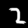

# Goal

It is easy for a human to trace out lines when they look at a handwritten letter or digit. In general, we can easily see how to trace out a line drawing. But can a computer do it? The goal of this project is to get a computer to trace out lines in an image.

# What's included

The root of this repository is a Go package containing the current solution.

The [solve/](solve) directory contains a command for running the current solution on a random line drawing (e.g. a line drawing drawn by the datadraw utility described below).

The [datadraw/](datadraw) directory is a web application for creating line drawings and saving them as raw JSON. I currently don't use datadraw for the tracing algorithm itself, but I do use it to generate JSON files for use with the solve command. I am mostly keeping it around because it may be relevant to future solutions.

The [results/](results) directory contains some example results from the current solution.

# Current solution

The current solution uses a greedy search algorithm. It does not do incredibly well, but it does get fairly reasonable results:

<table>
  <tr>
    <td>Original</td>
    <td>Reconstructed Path</td>
  </tr>
  <tr>
    <td></td>
    <td></td>
  </tr>
  <tr>
    <td></td>
    <td></td>
  </tr>
  <tr>
    <td></td>
    <td></td>
  </tr>
  <tr>
    <td></td>
    <td></td>
  </tr>
  <tr>
    <td></td>
    <td></td>
  </tr>
  <tr>
    <td></td>
    <td></td>
  </tr>
</table>
